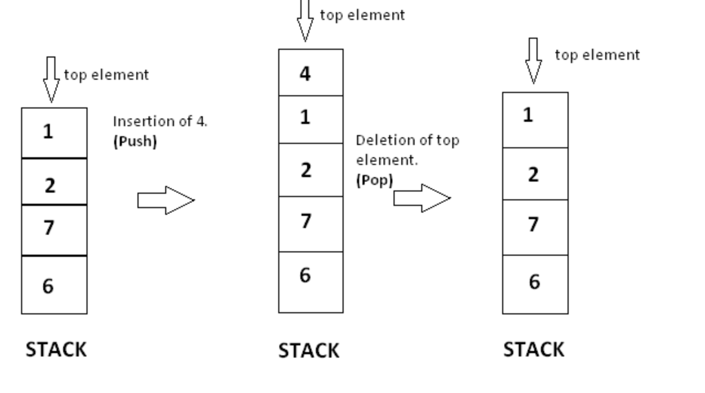
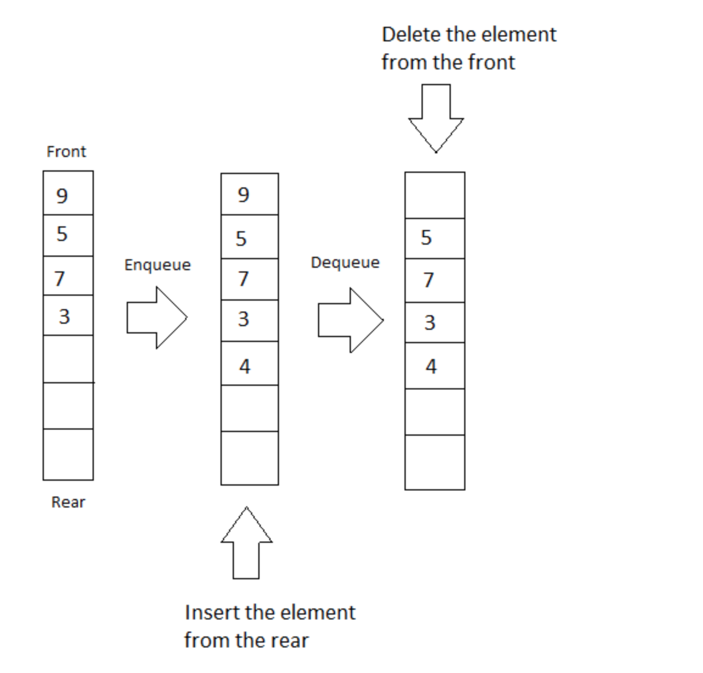

# Lab 7: Stacks And Queues

Welcome to Lab 7! In Lab 7 we will be implementing our very own Hotel, with two diffrent data structures a stack and queue. We will also take a look at a library called LocalDateTime which will allow our program to keep track of the time of when guests check in and out of the hotel. Lets get started!

# Stacks
Stack is a collection of elements, that follows the LIFO order. LIFO stands for Last In First Out, which means element which is inserted most recently will be removed first. Imagine a stack of trays on the table. When you put a tray there you put it at the top, and when you remove it, you also remove it from the top. A stack has a restriction that insertion and deletion of element can only be done from only one end of stack and we call that position the topOfStack. The element at the top position is called the top element. Insertion of an element is called PUSH and deletion is called POP.

# Queues
Queue is a data structure that follows the FIFO principle. FIFO means First In First Out i.e the element added first in the queue will be the one to be removed first. Elements are always added to the back and removed from the front. Think of it as a line of people waiting for a bus at the bus stand. The person who will come first will be the first one to enter the bus. Queue supports some fundamental functions: Enqueue adds an element to the back of the queue and Dequeue removes the element from the front of the queue.

# Lab Instructions
What you will do today in lab is implement a StackHotel based on the stack data structure and a QueueHotel based on the queue data structure. Some fundemental things to remeber for this lab is that a stack is LIFO(Last in first out) and queue is FIFO(first in first out). With that being said lets get into the classes and functions that you will be implementing. 

# Guest Class
A class which represents a single guest staying in the hotel. Rooms are added into the Hotel. The Room has three Characteristics, a Name    which is the name of the person checking into the room , the time that they checked in and the room number the guest is staying in.
The name is represented as a String, and the time checked in is represented as a LocalDateTime object and the room number is represented as an int. 

Methods to implement:
* Implement getters for name and the LocalDateTime object.
* Implement a toString method in the following format: <name> in Room <room number>.
  
  
# Hotel Class
This class represents a Hotel. This class is abstract due to the fact of how we are implementing the stacks and queues. Here we will provide a blueprint for our StackHotel and QueueHotel to implement. The order in which Guests are added into the hotel will also depend on how the StackHotel and QueueHotel implement the abstract methods in this class. A few things to note that are provided in the class is the DateTimeFormatter object created. This DateTimeFormatter acts in a manner, that given a LocalDateTime object, it will format it in the pattern declared when it is initilized. 

Methods to implement:
* Implement getters for name and the LocalDateTime object.
* Define the abstract method 
* Implement checkOut(LocalDateTime timeCheckedOut) method: Check the TODO provided in the method.
 
 # StackHotel class
 This class represents a StackHotel. Keep in mind, a stack is collection of elements, that follows the LIFO order. LIFO stands for Last In First Out, which means element which is inserted most recently will be removed first. Implemantion for the stack requires us to keep track of topOfStack pointer to know which element was inserted last into the stack. The hotel class is a parent to the StackHotel class.
 Methods to implement:
 * Upon connecting it with the parent class (hotel), implement all abstract methods defined.
 
 # QueueHotel
 This class represnets a QueueHotel. Keep in mind, Queue is a data structure that follows the FIFO principle. FIFO means First In First Out i.e the element added first in the queue will be the one to be removed first. In this class we will need a head to represent the first element inserted and a tail to represent where the next open position is. The hotel class is a parent to the QueueHotel class.
  Methods to implement:
 * Upon connecting it with the parent class(hotel), implement all abstract methods defined.
 
 
 
 

 
       
        
        

