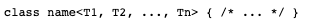
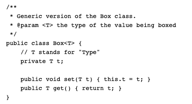

# Lab 9: Generics and PriorityQueue
Welcome to Lab 9! In Lab 9 we will take a look at generics in Java and also look into the PriorityQueue data structure. In order to demonstrate generics in java we will be taking a look back at a previous lab(Lab 7: Stacks and Queues) and making slight modifications to it. Lets get started.

# Generics In Java
A generic type is a generic class or interface that is parameterized over types. What this means is that generic types allow us to write a generic class or method that works with diffrent types(i.e.: String, Integer, Double, Guest) which will allow for code re-use.

# Declaring A Generic Class
* The declaration of generic class looks as such: 

* The type parameter section, delimited by angle brackets (<>), follows the class name. It specifies the type parameters (also called type variables) T1, T2, ..., and Tn. The type varaibles can be any non-primitive type(String, Integer, Double, Guest, etc..)

# Example of Generic Class

* A few things to note here:
 Notice the declarion of the variable of the name t. We are declaring this variable as Type T and what this says is that when the box object is created, take the type passed in(String, Double, Integer) and set it as the type of this variable..

# Declaring a Generic Class Object
* Box<Integer> integerBox = new Box<>(); // a box of type integer. 
* Box<String> stringBox = new Box<>(); // a box of type string.

# PriorityQueue 
A PriorityQueue is used when the objects are supposed to be processed based on the priority. It is known that a queue follows First-In-First-Out algorithm, but sometimes the elements of the queue are needed to be processed according to the priority, that’s when the PriorityQueue comes into play. The PriorityQueue is based on the priority heap. The elements of the priority queue are ordered according to the natural ordering, or by a Comparator provided at queue construction time, depending on which constructor is used.
[PriorityQueue Java Api Link](https://docs.oracle.com/javase/8/docs/api/java/util/PriorityQueue.html "PriorityQueue Java Api Link")

# Lab Instructions
What you will do today in lab is make some minor adjusments to your previous lab 7 to accomadate for generic types and also implement a PriorityQueueHotel. The tempelate is set up with TODO comments on portions of the lab that you will be filling in. The next section will break down diffrent aspects of the lab that need to be completed. 

# Guest Class
A class which represents a single guest staying in the hotel. Rooms are added into the Hotel. The Room has three Characteristics, a Name    which is the name of the person checking into the room , the time that they checked in and the room number the guest is staying in.
The name is represented as a String, and the time checked in is represented as a LocalDateTime object and the room number is represented as an int. 

Methods to implement:
* Implement a getter for the name object which may be any Type. 
* Implement a toString method in the following format: <name> in Room <room number>. Hint: Use StringBuilder to format. 
* Implement a compareTo method which will we be needed for the PriorityQueue to sort the guests in a certain priorirty. The comparasion will be based on the room number.
  
 # StackHotel class
 This class represents a StackHotel. Keep in mind, a stack is collection of elements, that follows the LIFO order. LIFO stands for Last In First Out, which means element which is inserted most recently will be removed first. Implemantion for the stack requires us to keep track of topOfStack pointer to know which element was inserted last into the stack. The hotel class is a parent to the StackHotel class.
 Methods to implement:
 * Upon connecting it with the parent class (hotel), implement all abstract methods defined.
 * The diffrence between the Lab 7 and Lab 9 is rather than holding our guests in an Array we will hold them in an Arraylist. 
 
 # QueueHotel
 This class represnets a QueueHotel. Keep in mind, Queue is a data structure that follows the FIFO principle. FIFO means First In First Out i.e the element added first in the queue will be the one to be removed first. In this class we will need a head to represent the first element inserted and a tail to represent where the next open position is. The hotel class is a parent to the QueueHotel class.
  Methods to implement:
 * Upon connecting it with the parent class(hotel), implement all abstract methods defined.
  * The diffrence between the Lab 7 and Lab 9 is rather than holding our guests in an Array we will hold them in an Arraylist. 
  # PriorityQueueHotel
  This class represents a PriorityQueueHotel. Keep in mind the PriorityQueue requires a compareTo method to sort the guests in the PriorityQueue. The compareTo method will be defined in the guest class ordering guests in the PriorityQueue based on natural ordering of the room number. That means when we remove a guest from the PriortityQueue the first one out should be the guest with the lowest number and so on. 
  * Upon connecting it with the parent class(hotel), implement all abstract methods defined.
  * Use the PriorityQueue data structure defined in the Java library. The Api contains all of the methods required to add, remove, check next, and remove a guest so please use that for assistance when implementing the PriorirtyQueue.

 
 
 
 

 
       
        
        

